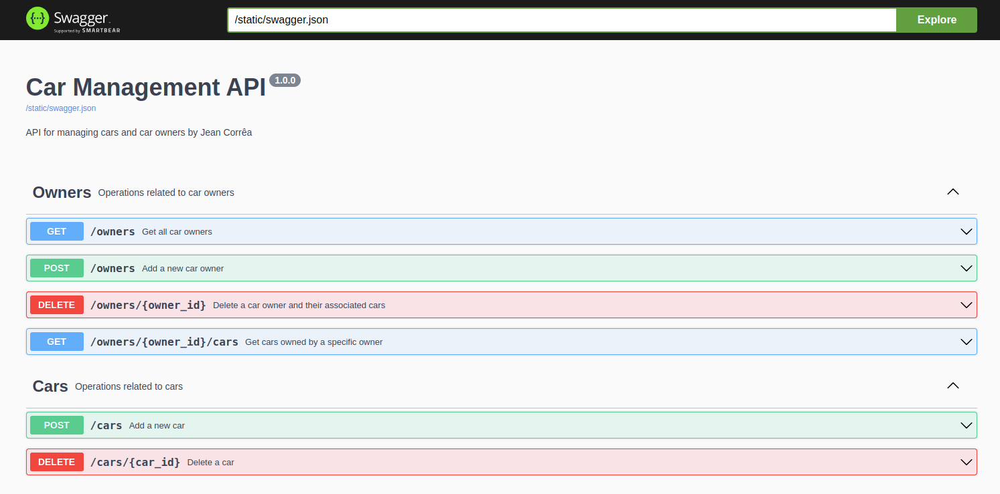

#  CarFord - AdviceHealth

---

<p align="center"> The AdviceHealth Cartord project is a web application built using Flask and PostgreSQL, 
deployed within Docker containers. It provides a platform for managing CarFord's cars and car owners. </p>

---

<p align = "center" >📌 
    <a href="#">PRÉ-REQUISITOS</a>
    <a href="#">FUNÇÕES</a>
    <a href="#">PROJETO</a>
    <a href="#">TECNOLOGIAS</a>
    <a href="#">AUTOR</a>📌 
</p> 

---

### 📋  PREREQUISITES:

To set up and run this project, make sure you have the following prerequisites installed:

1. **Python**: Version 3.9 or higher
   - [Python Installation Guide](https://www.python.org/downloads/)


2. **Docker**:
   - Installation: [Docker Installation Guide](https://docs.docker.com/get-docker/)


3. **Docker Compose** (usually included with Docker Desktop for Windows and macOS, but may need to be installed separately on Linux systems):
   - Installation: [Docker Compose Installation Guide](https://docs.docker.com/compose/install/)
 

4. **Virtual Environment**: It's highly recommended to use a virtual environment to isolate your dependencies from other projects. You can create a virtual environment using `venv`:

   ```bash
   python -m venv venv
   source venv/bin/activate  # on Windows use `venv\Scripts\activate`

5. **Install dependenceies**:

    ```bash
    pip install -r requirements.txt


6. **Run containers**:
   ```bash
   make build
   
---
### HOW TO USE:

| Endpoint                         | Method | Description                                                                                         | Example Usage                                                                                     |
|----------------------------------|--------|-----------------------------------------------------------------------------------------------------|---------------------------------------------------------------------------------------------------|
| `/cars`                          | POST   | Adds a new car for a specific owner.                                                                | `curl -X POST -H "Content-Type: application/json" -d '{"color":"blue", "model":"sedan", "owner_id":1}' http://localhost:5000/cars` |
| `/cars/<car_id>`                 | DELETE | Removes a specific car by its ID.                                                                   | `curl -X DELETE http://localhost:5000/cars/1`                                                     |
| `/owners`                        | POST   | Adds a new car owner.                                                                               | `curl -X POST -H "Content-Type: application/json" -d '{"name":"John Doe", "email":"john@example.com"}' http://localhost:5000/car_owners` |
| `/owners`                    | GET    | Retrieves a list of all registered car owners.                                                      | `curl http://localhost:5000/car_owners`                                                           |
| `/owners/<owner_id>/cars`    | GET    | Retrieves a list of cars belonging to the specified owner by `owner_id`.                            | `curl http://localhost:5000/car_owners/1/cars`                                                    |
| `/owners/<owner_id>`         | DELETE | Removes a specific car owner by their ID, along with all associated cars.                            | `curl -X DELETE http://localhost:5000/car_owners/1`                                                |

---

### DOCUMENTATION:



---
### 🛠️ Tools and Technologies:

The following tools were used to build the project:

- Python
- Flask
- SQLAlchemy
- PostgreSQL
- Docker and Docker Compose
- Heroku for deploy

---

✒️ By: <a href="https://github.com/Jeanlcorrea">Jean Correa</a>. 
